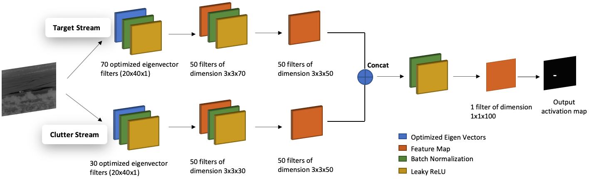
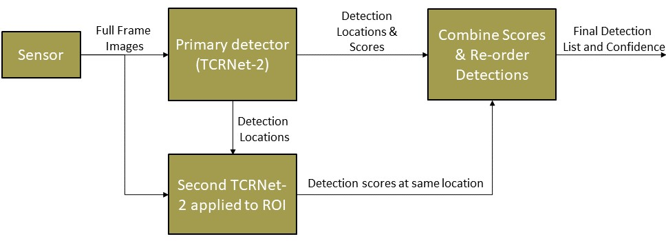
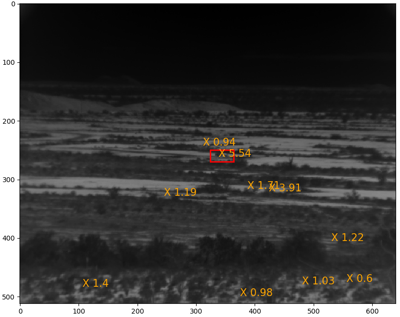
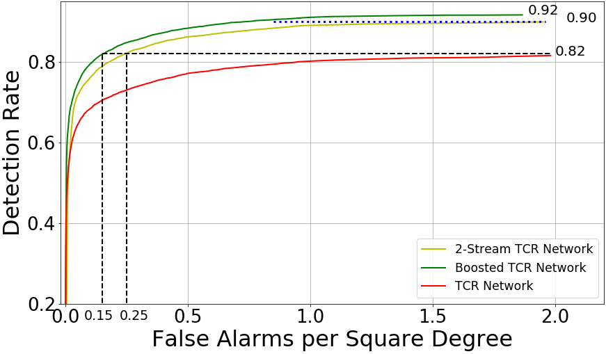

# Two-Stream Boosted TCRNet for Range-Tolerant Infra-Red Target Detection
[](https://ieeexplore.ieee.org/abstract/document/9506170)
[](https://drive.google.com/file/d/1Ob3f8skltIrjZNYhHhe2fqW4LLX2GXBO/view)

## Overview
This repository presents **TCRNet-2**, an improved deep-learning model for detecting vehicular targets in infrared imagery. By processing target and clutter information in parallel and optimizing the **Target-to-Clutter Ratio (TCR)**, TCRNet-2 outperforms conventional CNNs and the original TCRNet. Additionally, a boosted version further enhances target-clutter discrimination, reducing false alarms. Performance is evaluated on a public infrared dataset, showing significant improvements across various distances and lighting conditions.

This repository contains scripts and instructions to preprocess data, train models, and test TCRNet-2 booster models. Below is a detailed guide to understanding and running the scripts and using the data files.

## Table of Contents
- [Model Overview](#model-overview)
- [Scripts](#scripts)
- [Script Descriptions and Sequence](#script-descriptions-and-sequence)
- [Supporting Scripts](#supporting-scripts)
- [Folders and Files](#folders-and-files)
- [Train](#train)
- [Test](#test)
- [Dependencies](#dependencies)

---

## Model Overview
**TCRNet-2** is a two-stream neural network designed for zero-shot object detection, where target and clutter information are processed in separate channels for better discrimination. The first layer of the network uses fixed, analytically derived filters based on eigen-vectors to optimize the TCR metric, while the remaining layers are trained via gradient descent to further enhance target-clutter separation. The final output is generated by concatenating the two streams and applying a convolution layer, after which local maxima in the activation map are used to detect targets.



The **Boosted TCRNet-2 pipeline** enhances target detection by using a two-stage network, where the first network acts as a primary detector, identifying potential regions of interest (ROIs). The second network refines detections by focusing only on false positives from the primary network, leading to improved target-to-clutter ratio (TCR) and better overall detection accuracy.

<p align="center">
    
</p>


## Scripts

### Script Descriptions and Sequence
Run the scripts in the following sequence for proper execution:

1. **`extract_chip.py`**  
   - Creates 40x80 chips to train the networks.

2. **`center_crop_chip.py`**  
   - Crops 40x80 chips to 20x40 to generate the QCF filters for the first layer.

3. **`hard_clutter_tcrnet2_chip.py`**  
   - Creates hard clutter for the booster TCRNet-2.

4. **`qcf_basis.py`**  
   - Generates the QCF filters.

5. **`train_tcr2.py`**  
   - Trains both TCRNet-2 and TCRNet-2 booster models.

6. **`test_tcr2.py`**  
   - Tests the TCRNet model.

7. **`roc_multiple_TCRNets.py`**  
   - Plots the ROC curves.

---

### Supporting Scripts
The following scripts are called within the above scripts:
- **`tcr_cnn_2streams.py`**  
  - Contains the model architecture.
  
- **`imresize.py`**  
  - Scales images to a 2500m range.
  
- **`crop.py`**  
  - Crops images.

---

## Folders and Files

- **`weights_filters/`**  
  - Contains trained models and filters.

- **`data/`**  
  - Contains JSON files with test image information for various ranges (2.5 km, 3.0 km, and 3.5 km). It also includes training and testing datasets.
    - **`test_25to35all.json`**: Both day and night images.
    - **`test_25to35day.json`**: Day images.
    - **`test_25to35night.json`**: Night images.

- **`requirements.txt`**  
  - Lists all Python libraries required for this project.

---

## Train

To train the TCRNet-2 and TCRNet-2 booster models:

1. Ensure the required datasets are available in the `data/` directory.
2. Generate QCF filters by running:  
```
   python qcf_basis.py
```
3. Train the models using:  
```
   python train_tcr2.py
```
4. During the training process, the trained weights and filters will be saved in the `weights_filters/` directory.

---

## Test

To test the trained TCRNet models:

1. Ensure that the trained model weights and filters are available in the `weights_filters/` directory.
2. Run the testing script:  
```
   python test_tcr2.py
```
3. To visualize the performance of multiple TCRNets, generate ROC curves using:  
```
   python roc_multiple_TCRNets.py
```

---

## Dependencies

To set up the environment, install the required dependencies by running:  
```
pip install -r requirements.txt
```

---

## Performance
The **quantitative figure** illustrates the detection performance of TCRNet-2, where × marks indicate detected objects with confidence scores, and the red boundary represents the ground truth for evaluation.

<p align="center">
    
</p>

The ROC curves below compare the performance of TCRNet, TCRNet-2, and its boosted version on day and night test images. TCRNet-2 and its boosted version outperform the original TCRNet, achieving a higher probability of detection (Pd) and significantly lower false alarm rates (FAR). Notably, at Pd = 0.92, the boosted TCRNet-2 reduces FAR by 13× compared to the original model, demonstrating improved detection accuracy and robustness.

<p align="center">
    
</p>

## Data Availability

To request access to the data, please contact **DSIAC** through their official portal:

🔗 [Infrared Imagery Datasets – DSIAC](https://dsiac.dtic.mil/technical-inquiries/notable/infrared-imagery-datasets/)

<!--
## Notes
Ensure that the data and required files are correctly placed in the respective directories before running the scripts. Follow the sequence mentioned above for the smooth execution of the project pipeline.
-->
